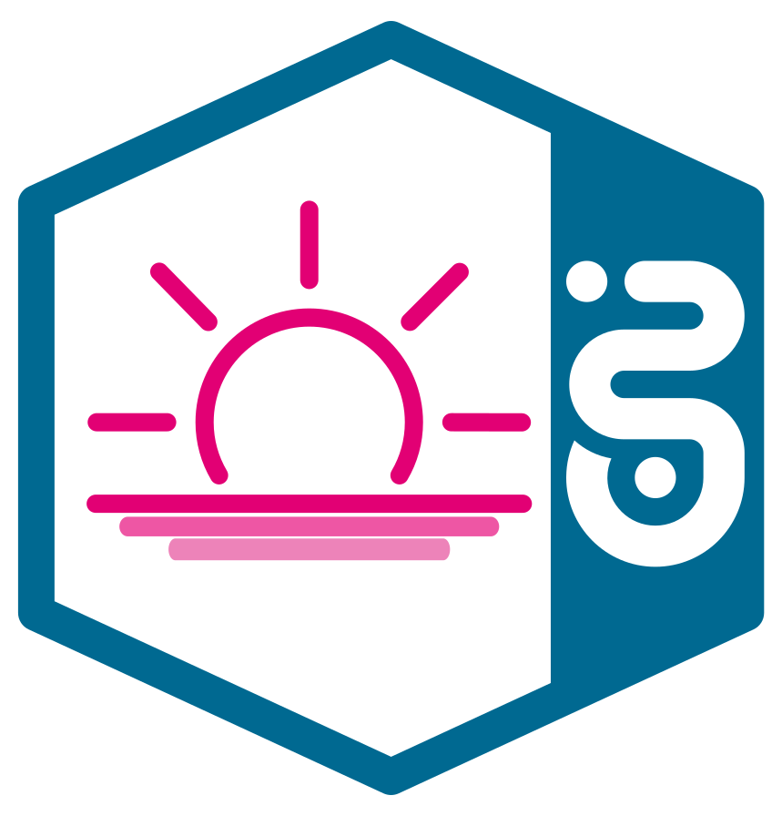

<!--
Copyright 2024 Deutsche Telekom IT GmbH

SPDX-License-Identifier: Apache-2.0
-->

<h1 align="center">Horizon Galaxy</h1>

<p align="center">
  
  <br>
  <em>Horizon component for efficient event message multiplexing</em>
  <br>
</p>
<p>
  <a href="#overview">Overview</a>
  ·
  <a href="#development">Development</a>
  ·
  <a href="#next-steps">Next Steps</a>
  ·
  <a href="#documentation">Documentation</a>
  ·
  <a href="#changelog">Changelog</a>
  ·
  <a href="#related-projects">Related Projects</a>
</p>

- [Overview](#overview)
- [Development](#development)
    - [Prerequisites](#prerequisites)
    - [Setting Up for Development](#setting-up-for-development)
    - [Operational Information](#operational-information)
    - [Local Integration Test with Tracing](#local-integration-test-with-tracing)
- [Next Steps](#next-steps)
- [Documentation](#documentation)
- [Changelog](#changelog)
- [Related Projects](#related-projects)

<hr>

## Overview

Horizon Galaxy is a crucial component within the Horizon architecture, designed to efficiently multiplex published event messages for each subscription on the respective event type. It plays a key role in managing the flow of events, ensuring duplicates are handled appropriately, and transforming them based on defined response filters.

## Development

### Prerequisites

To test changes locally, ensure the following prerequisites are met:

1. Have a Kubernetes config at `${user.home}/.kube/config.laptop-awsd-live-system` pointing to a non-production cluster.
Having a namespace as configured in `kubernetes.informer.namespace` and a CustomResource `subscriptions.subscriber.horizon.telekom.de`. 
The resource definition can be found in the [Horizon Essentials Helm Chart](https://gitlab.devops.telekom.de/dhei/teams/pandora/argocd-charts/horizon-3.0/essentials/-/tree/main?ref_type=heads)


### Setting Up for Development

Follow these steps to set up Horizon Galaxy for local development:

#### 1. Clone the Repository

```bash
git clone [repository-url]
cd galaxy
```

#### 2. Install Dependencies
```bash
./gradlew build
```

#### 3. Start docker-compose
```bash
docker-compuse up -d
```

#### 4. Run Locally
```bash
./gradlew bootRun --args='--spring.profiles.active=dev'
```
This command will start Horizon Galaxy in development mode.


### Operational Information

GalaxyService uses an exit code of -2 to shut down the application when the Kafka consumer container stops listening to new Kafka messages.

### Local Integration Test with Tracing

Horizon Galaxy includes integration tests that run against an embedded Kafka. To enable local tracing, follow these steps:

1. Spin up Jaeger within Docker using `docker-compose-tracing.yaml`
2. Uncomment the Zipkin disablement in `AbstractIntegrationTest.java`

## Next Steps
Explore the project, make changes, and contribute to the Horizon ecosystem.

## Documentation

- [Environment Variables](docs/env-docs.md)
- [Architecture](docs/architecture.md)
- [Getting Started](docs/getting-started.md)

## Code of Conduct

This project has adopted the [Contributor Covenant](https://www.contributor-covenant.org/) in version 2.1 as our code of conduct. Please see the details in our [CODE_OF_CONDUCT.md](CODE_OF_CONDUCT.md). All contributors must abide by the code of conduct.

By participating in this project, you agree to abide by its [Code of Conduct](./CODE_OF_CONDUCT.md) at all times.

## Licensing

This project follows the [REUSE standard for software licensing](https://reuse.software/).
Each file contains copyright and license information, and license texts can be found in the [./LICENSES](./LICENSES) folder. For more information visit https://reuse.software/.

### REUSE

For a comprehensive guide on how to use REUSE for licensing in this repository, visit https://telekom.github.io/reuse-template/.   
A brief summary follows below:

The [reuse tool](https://github.com/fsfe/reuse-tool) can be used to verify and establish compliance when new files are added.

For more information on the reuse tool visit https://github.com/fsfe/reuse-tool.