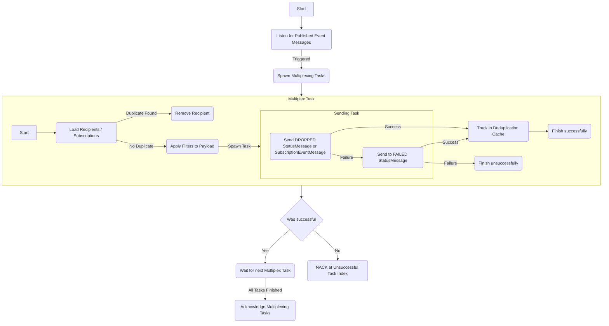

# Architecture
The primary function of the Galaxy component is to produce a subscription-based event message for every respective subscriber, relative to the particular type of published event message. For this purpose, the component is configured to monitor the "published" Kafka topic. The activation of the component is prompted by each newly published event message from this topic.

Upon activation, the Galaxy component commences a fresh multiplexing task and fetches the applicable recipients based on their respective event subscriptions. Each event subscription comprises filters instituted by the subscriber. Once the recipients have been cataloged, the component scrutinizes the deduplication cache to discern if there's already a multiplexed version of the event message for a specific recipient. In case of redundancy, the recipient is pruned for the current cycle. Filters of the persisting recipients are then evaluated against the event payload. These filters offer the ability to alter or eliminate payload components or reject the event entirely.

After this step, the Galaxy component assesses the results of the filter application and constructs either a subscription event message with the adjusted payload or a status message labeled "dropped", specifying that the event should not be propagated to the consumer due to certain filter regulations. Each resultant message consists either of SubscriptionEventMessage or StatusMessage and is dispatched concurrently towards one of the "subscribed" Kafka topics. If an anomaly crops up during this process, a StatusMessage exhibiting a "failed" status is released for the respective subscription event message. The multiplexing task retains a wait state until all messages have been successfully conveyed to Kafka. Upon successful delivery to Kafka, the corresponding SubscriptionEventMessage sent for an associated recipient is annotated in the deduplication cache. This is to avoid the recreation and re-dispatch of the SubscriptionEventMessage by any other multiplex task, potentially triggered by an unsuccessful published event message in the batch.

Galaxy processes the published event messages in bundles, each message prompting a single multiplex task operation. Prior to proceeding with the next batch, the component holds processes to allow the ongoing multiplex tasks to culminate sequentially. Despite concurrent execution, they are completed in order. In case of a failure in a multiplex task, the Galaxy component acknowledges all multiplex tasks that occurred prior to the failed one and nacks at the index of the failed task. As a result, all tasks post the failed one also nack, leading to their eventual re-dispatch by Kafka.

Additionally, the Galaxy component, akin to every other component in Horizon, incorporates logs, tracing, and metrics to record its functionalities and performance metrics.

## Flowchart


## State Diagram
````mermaid
stateDiagram
    [*] --> PROCESSED
    [*] --> DROPPED
    [*] --> FAILED
````